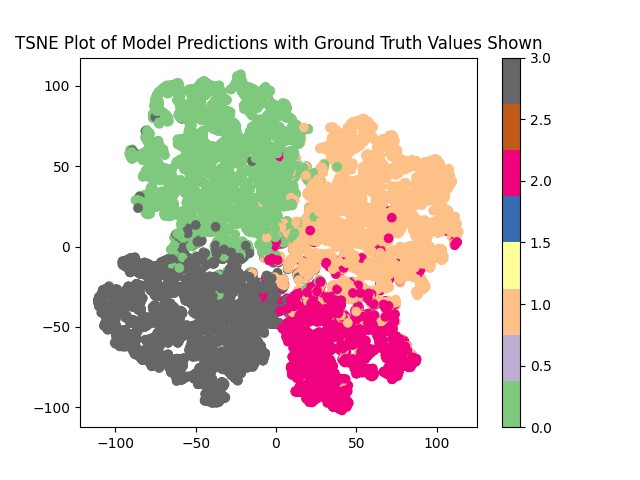

# Graph Convolutional Networks for semi-supervised node classification

This project uses a multi-layered Graph Convolutional Network from the pytorch-geometric package to perform semi-supervised node classification on the MUSAE Facebook Large Page-Page Dataset (link to download [here](https://snap.stanford.edu/data/facebook-large-page-page-network.html)). 
This project primarily uses a multi-layer network of graph convolutional operators using PyTorch Geometric. The theoretical work for these operators is from the *Semi-supervised Classification with Graph Convolutional Networks* paper ([link](https://arxiv.org/abs/1609.02907)). 
The general principle at play is to adapt a regular convolution layer to the unique geometry engendered by the input graph. This is done by effectively convolving over the neighbours of a given node instead of using gridwise neighbours. 
The specific problem solved is to classify Facebook pages into one of four categories ("Government", "Company", "Political" and "TV Show") based on the name of the page and their mutual connections to other pages.

## Instructions for use

Download the MUSAE dataset to this directory and unzip it (alternatively, if you have the unzipped folder elsewhere, edit the `DATA_PATH` constant in `dataset.py` to the location of the outermost folder). From there `train.py` can be run to create, train and save a GCN model for the MUSAE dataset. `predict.py` can be run to see analysis of a trained model on the dataset.

## Dependencies

`torch` Version 2.8.0 |
`torch-geometric` Version 2.7.0 |
`sentence-transformers` Version 5.1.2 |
`numpy` Version 2.3.2 |
`pandas` Version 2.3.1 |
`matplotlib` Version 3.10.5 |
`scikit-learn` Version 1.7.2

## Example of Trained Model

Using the provided scripts, a consistent accuracy of around 95% was achieved on test data for the MUSAE dataset.

For one such model (with an accuracy of 94.64%), a TSNE plot is provided (with legend \[0: government, 1: company, 2: tvshow, 3: politician\]):

From this plot, the model clearly separates the nodes by colour quite consistently. Notably however, there is some minor overlap between politician (grey) and government (green), and between tvshow (red) and company (yellow). This succinctly demonstrates both the success of the model in classifying the nodes, and some areas for further improvements.
